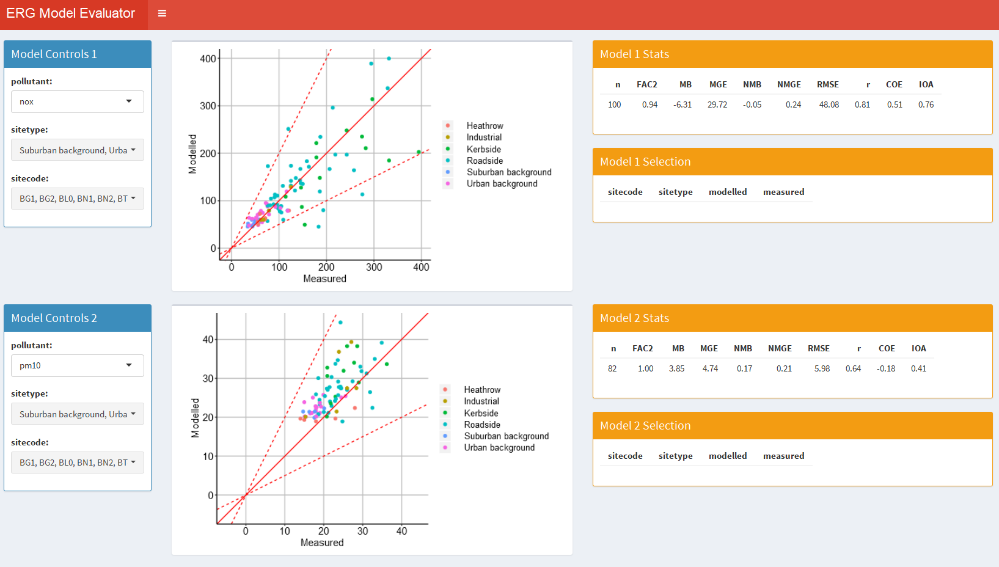

# Shiny air quality dashboard
A dashboard for viewing modelled v. measured output data from the King's modelling team. Accepts two model outputs uploaded as CSV files, then allows interaction and exploration of the data. Based on the tutorials avaiable here: (https://rstudio.github.io/shinydashboard/(['https://rstudio.github.io/shinydashboard/]') . Example image below. Live deployment available at: (https://jimshady.shinyapps.io/AirQualityModelEvaluationV2/)['https://jimshady.shinyapps.io/AirQualityModelEvaluationV2/']

